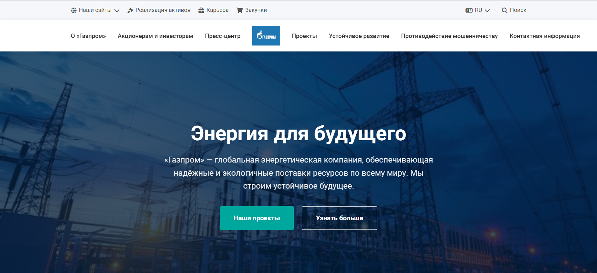

# Gazprom

Многостраничный корпоративный сайт-реплика ПАО «Газпром», свёрстанный с нуля на чистых HTML, CSS и JavaScript — без фреймворков, препроцессоров и конструкторов.

## 🔗 Живая ссылка
https://angelina557744.github.io/gazprom/

## 🛠 Стек технологий

- **HTML5** — семантическая разметка (`header`, `nav`, `main`, `section`, `article`, `aside`, `footer`), ARIA-атрибуты
- **CSS3** — Flexbox, CSS Grid, CSS-переменные, медиа-запросы, `clamp()`, `aspect-ratio`, `object-fit`, `prefers-reduced-motion`
- **JavaScript (Vanilla)** — без библиотек и фреймворков
- **Font Awesome** — иконки через CDN
- **Google Fonts** — Roboto и Open Sans
- **Leaflet** — интерактивная карта на странице «Контакты»

## 📄 Страницы проекта

- **Главная** — hero-секция, преимущества, новости, ключевые направления
- **О компании** — история, миссия, структура, чередующиеся секции «текст + изображение»
- **Акционерам и инвесторам** — сайдбар с якорной навигацией, таблица финансовой отчётности, плавный скролл
- **Пресс-центр** — вкладки с переключением на JavaScript, сетка новостей
- **Контакты** — карточки адресов, телефонов, email, интерактивная карта Leaflet с маркером офиса
- **Страница-заглушка** — универсальный шаблон для ещё не свёрстанных разделов

## ✨ Что реализовано

- Фиксированная двухуровневая шапка с верхней сервисной панелью
- Центральный логотип и симметричная навигация слева и справа
- Выпадающий переключатель языков
- Модальное окно поиска
- Мобильное меню-оверлей с бургер-кнопкой и блокировкой скролла
- Hero-секции с фоновыми изображениями и градиентными оверлеями
- Сетки преимуществ и новостей на CSS Grid
- Чередующиеся секции «текст + изображение» на Flexbox
- Вкладки пресс-центра на нативном JavaScript
- Таблица финансовой отчётности
- Сайдбар инвесторов с якорной навигацией и плавным скроллом
- Контактная страница с карточками адресов, телефонов, email и официальных сайтов
- Интерактивная карта Leaflet с маркером офиса компании

## 🏗 Архитектура стилей

Стили организованы в единый `style.css`:

- CSS-переменные для цветов, отступов, типографики
- БЭМ-подобная методология именования классов
- Адаптив от 320 до 1920 пикселей через медиа-запросы на 1200, 1100, 992, 768 и 576 пикселей
- Поддержка `prefers-reduced-motion` для пользователей с ограничениями по анимации
- Гибкие изображения через `object-fit` и `aspect-ratio`
- Оптимизированная типографика на `clamp()`

## 📱 Адаптивность

Проект протестирован и корректно отображается на всех разрешениях:

- Мобильные: 320–576 px
- Планшеты: 576–992 px
- Ноутбуки: 992–1200 px
- Десктоп: 1200–1920 px

## 🎯 Что демонстрирует проект

- Адаптивная вёрстка по макету без конструкторов
- Работа с Flexbox и CSS Grid для сложных раскладок
- Создание интерактивных элементов на нативном JavaScript (модалки, вкладки, бургер-меню, переключатели)
- Интеграция сторонних библиотек (Leaflet, Font Awesome, Google Fonts)
- Построение переиспользуемой CSS-архитектуры на переменных
- Семантическая HTML-разметка с ARIA-атрибутами
- Работа с адаптивной типографикой через `clamp()`

## 💡 Что было сложным

- Собрать двухуровневую шапку с центральным логотипом и симметричной навигацией по бокам
- Сделать мобильное меню-оверлей с блокировкой скролла без сторонних библиотек
- Организовать единый CSS-файл так, чтобы он оставался читаемым при таком количестве секций
- Настроить адаптив от 320 до 1920 px без потери пропорций

## 📜 Лицензия

Проект создан в учебных целях. Все права на контент и товарные знаки принадлежат ПАО «Газпром».
